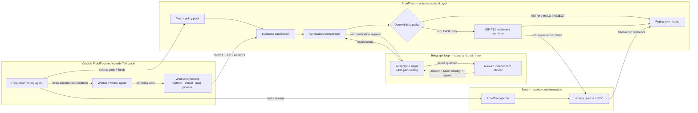

# Where ProofPact sits

## The short answer

ProofPact is a **verification-and-settlement application layer**. It sits after work has been commissioned but before payment is released.

If PostgreSQL is a persistence layer and Cloudflare is an edge/infrastructure layer, ProofPact is the **commercial outcome-control layer** in an agent workflow:

```text
commission work → perform work → [PROOFPACT verifies and controls settlement] → pay worker
```

It combines an offchain application with an onchain escrow:

- the application defines the pact, receives evidence, calls Telegraph, normalizes responses, and applies deterministic policy;
- the Base contract holds funds and executes only an authorized outcome;
- the receipt joins the offchain verification evidence to the onchain settlement.

## System design



The hiring and work lanes are not part of the Telegraph loop. Telegraph is entered only by the orchestrator’s paid verification request and exited when the routed result returns.

## What touches what

| System | What it gives ProofPact | What ProofPact gives it |
| --- | --- | --- |
| Requester or hiring agent | Milestone, reward, worker, acceptance criteria | A funded and inspectable verification contract |
| Worker or worker agent | Deliverable and evidence references | Requirements before work, remediation feedback, payment on pass |
| GitHub/Vercel/external work tools | Commit, deployment, logs, immutable references | Nothing privileged; ProofPact reads or receives bounded evidence |
| Telegraph | Ranked Miner routing, paid intelligence, signal metadata | Real x402 demand across required intents |
| Base | Escrow custody and transaction finality | Valid bounded authorization after policy passes |
| Database/object storage | Pact state and evidence artifacts | Append-only records and content commitments |
| MCP client | Structured agent requests | The same pact use cases exposed as safe tools |

## Where it starts

ProofPact starts at the commercial agreement. A requester arrives with work they want completed. They select a policy pack, define the milestone and evidence, choose a worker, and fund escrow.

ProofPact does not need to be where the worker was discovered. A marketplace, DAO, company, human, or another agent can send the requester and worker into the same pact.

## Where it stops

ProofPact stops after one of these terminal responsibilities:

- it authorizes and records a release;
- it records a terminal rejection/refund/dispute transition;
- it produces the immutable receipt explaining the outcome.

It does not continue operating the delivered application, guarantee all future behavior, rank Telegraph Miners itself, custody funds outside its escrow, or reverse a completed chain transaction. Optional monitoring can govern an unreleased holdback milestone, not claw back settled funds.

## One concrete walkthrough

Assume a startup hires a coding agent to patch `CVE-X` in an API.

### 1. The requester uses ProofPact

In `/app/jobs/new`, the startup selects **Secure Delivery**, enters the CVE, repository, deployment target, worker address, deadline, and 800 USDC reward. The UI shows the exact required checks before funding.

The wallet transaction deposits 800 USDC into the ProofPact escrow. The pact now has an immutable ID, policy version, recipient, reward, and acceptance commitment.

### 2. The agent works elsewhere

The coding agent edits the repository, opens a commit or pull request, and deploys through GitHub/Vercel. ProofPact is not the IDE or hosting platform.

### 3. The agent returns the delivery

The worker opens the pact or calls its future MCP tool and submits the commit hash, deployment URL, claimed fixed version, and requested evidence.

### 4. ProofPact buys verification

The server asks Telegraph for four independently routed answers:

- `FRAUD_DETECTION`: is the counterparty/submission/payment/evidence pattern suspicious?
- `CVE_LOOKUP`: is the vulnerability claim and fixed version correct?
- `URL_SCAN`: is the delivered endpoint unsafe or malicious?
- `SSL_VERIFICATION`: is its TLS/domain posture valid?

ProofPact validates each x402 challenge, enforces cost and retry ceilings, records the routed Miner, normalizes the answer, and rejects duplicate identities.

### 5. The first delivery fails

Suppose the URL still exposes the vulnerable route. Policy returns `HOLD`. The UI explains the failed requirement; no EIP-712 settlement authorization exists; Base still shows 800 USDC locked.

### 6. The worker remediates

The coding agent patches and redeploys, then submits the new commit and URL. The old evidence cannot be reused because it is bound to the previous artifact commitment.

### 7. Fresh evidence passes

ProofPact buys fresh routes. Every required intent clears the policy using unique Miners. Only now does the server create a bounded EIP-712 authorization for this pact, worker, amount, receipt, nonce, chain, contract, and deadline.

### 8. Base settles and ProofPact proves why

The escrow releases 800 USDC. `/app/receipts/[receiptId]` shows the policy, artifacts, Miner identities, signals, x402 costs, decision, authorization, and transaction. Replay recomputes the decision without calling Telegraph, spending USDC, signing, or executing.

## The UI model

ProofPact is experienced as a shared pact room rather than a generic security dashboard:

1. **Policy library** — understand what types of work can be verified.
2. **Create pact** — freeze requirements and fund the reward.
3. **Pact room** — requester and worker see the same milestone, delivery, escrow, and evidence state.
4. **Verification run** — see intent, unique Miner, cost, attempt, freshness, and normalized result.
5. **Remediation** — see precisely what failed and submit a new committed artifact.
6. **Settlement** — inspect the bounded authority and Base transaction.
7. **Receipt** — share and replay why payment moved or stayed locked.

The primary interface is the web app. After the full flow is proven, MCP becomes another doorway into these same use cases for external agents.

## Where these steps exist in the repository

| Product step | Current code | Current status |
| --- | --- | --- |
| Requester chooses a pack and describes work | [`app/app/jobs/new/page.tsx`](../app/app/jobs/new/page.tsx) and [`features/policies/domain/policy-pack.ts`](../features/policies/domain/policy-pack.ts) | UI/domain baseline; not persisted or funded yet |
| Worker performs work in GitHub/Vercel | External system | Intentionally outside ProofPact |
| Worker submits evidence | Job/submission use case and Route Handler still to be built | Not implemented |
| ProofPact constructs fraud verification | [`features/verification/application/fraud-verification.ts`](../features/verification/application/fraud-verification.ts) | Implemented and tested |
| ProofPact validates/pays x402 | [`infrastructure/x402/payment-policy.ts`](../infrastructure/x402/payment-policy.ts), [`authorized-fetch.ts`](../infrastructure/x402/authorized-fetch.ts) | Implemented and protocol-response tested; not called live here |
| Telegraph request and routed result | [`infrastructure/telegraph/engine-client.ts`](../infrastructure/telegraph/engine-client.ts) | Implemented with strict intent, cost, identity, signal, and size checks |
| Server-only live fraud composition | [`infrastructure/telegraph/live-fraud-verifier.ts`](../infrastructure/telegraph/live-fraud-verifier.ts) | Implemented; awaits explicit environment and live test authorization |
| Deterministic settlement decision | [`features/settlement/domain/evaluate-settlement.ts`](../features/settlement/domain/evaluate-settlement.ts) | Implemented and tested locally |
| Base escrow release | [`infrastructure/settlement/base-settler.ts`](../infrastructure/settlement/base-settler.ts) | Interface only; contract/adapter not yet implemented |
| Replayable receipt | Receipt route baseline plus future receipt domain | UI baseline; canonical receipt implementation remains |
